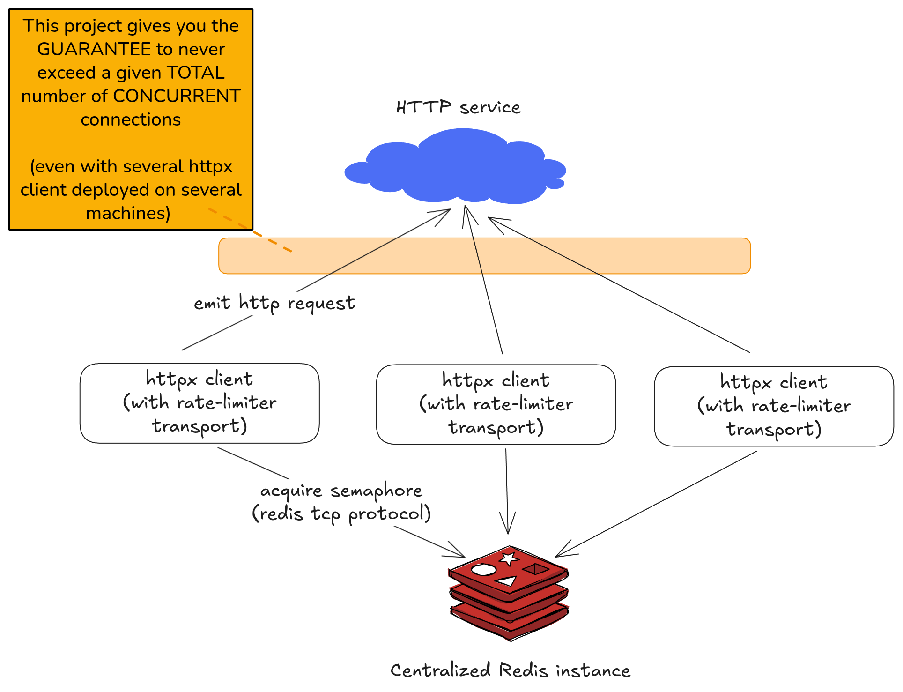

# httpx-rate-limiter-transport


[](https://docs.astral.sh/uv/)
[](https://mergify.com/)
[](https://docs.renovatebot.com/)
[](https://en.wikipedia.org/wiki/MIT_License)

## What is it?

This project provides an async transport for [httpx](https://www.python-httpx.org/) to implement various rate limiting (using a centralized redis as backend).



## Features

- Limit the total number of concurrent outgoing requests (to any host)
- Limit the number of concurrent requests per host
- Provide your own logic/limit
    - for example: you can limit the number of concurrent requests by HTTP method or only for some given hosts...
- TTL to avoid blocking the semaphore forever (in some special cases like computer crash or network issues at the very wrong moment)
- Can wrap another transport (if you already use one)

## Roadmap

- [ ] Add a "request per minute" rate limiting
- [x] Multiple limits
- [ ] Logging

## Installation

`pip install httpx-rate-limiter-transport`

## Quickstart

```python
import asyncio
import httpx
from httpx_rate_limiter_transport.backend.adapters.redis import (
    RedisRateLimiterBackendAdapter,
)
from httpx_rate_limiter_transport.limit import (
    ByHostConcurrencyRateLimit,
    GlobalConcurrencyRateLimit,
)
from httpx_rate_limiter_transport.transport import ConcurrencyRateLimiterTransport


def get_httpx_client() -> httpx.AsyncClient:
    transport = ConcurrencyRateLimiterTransport(
        limits=[
            # no more than 10 concurrent requests to any host (global limit)
            GlobalConcurrencyRateLimit(concurrency_limit=10),
            # no more than 1 concurrent request to any host (per host limit)
            ByHostConcurrencyRateLimit(concurrency_limit=1),
        ],
        backend_adapter=RedisRateLimiterBackendAdapter(
            redis_url="redis://localhost:6379", ttl=300
        ),
    )
    return httpx.AsyncClient(transport=transport, timeout=300)


async def request(n: int):
    client = get_httpx_client()
    async with client:
        futures = [client.get("https://www.google.com/") for _ in range(n)]
        res = await asyncio.gather(*futures)
        for r in res:
            print(r.status_code)


if __name__ == "__main__":
    asyncio.run(request(10))

```

## How-to

<details>

<summary>How to get a concurrency limit for only one given host?</summary>

To get a concurrency limit only for a given host, you can return `None` from your custom hooks to deactivate the
concurrency control for this specific request.

```python
import httpx
from httpx_rate_limiter_transport.backend.adapters.redis import (
    RedisRateLimiterBackendAdapter,
)
from httpx_rate_limiter_transport.limit import (
    SpecificHostConcurrencyRateLimit,
)
from httpx_rate_limiter_transport.transport import ConcurrencyRateLimiterTransport


def get_httpx_client() -> httpx.AsyncClient:
    transport = ConcurrencyRateLimiterTransport(
        limits=[
            # Limit the number of concurrent requests to 10 for any host matching *.foobar.com
            SpecificHostConcurrencyRateLimit(
                concurrency_limit=10, host="*.foobar.com", fnmatch_pattern=True
            ),
        ],
        backend_adapter=RedisRateLimiterBackendAdapter(
            redis_url="redis://localhost:6379", ttl=300
        ),
    )
    return httpx.AsyncClient(transport=transport, timeout=300)

```

</details>

<details>

<summary>How to implement your own custom logic?</summary>

You can use a `CustomConcurrencyRateLimit` object with a custom hook to implement your own logic.

If the hook returns None, this concurrency limit is deactivated. If the hook returns a key (as a string),
we limit the number of concurrent requests per distinct returned key.

```python
import httpx
from httpx_rate_limiter_transport.backend.adapters.redis import (
    RedisRateLimiterBackendAdapter,
)
from httpx_rate_limiter_transport.limit import CustomConcurrencyRateLimit
from httpx_rate_limiter_transport.transport import ConcurrencyRateLimiterTransport


def concurrency_key_hook(request: httpx.Request) -> str | None:
    if request.url.host == "www.foobar.com" and request.method == "POST":
        return "post on www.foobar.com"
    return None  # no concurrency limit


def get_httpx_client() -> httpx.AsyncClient:
    transport = ConcurrencyRateLimiterTransport(
        limits=[
            CustomConcurrencyRateLimit(
                concurrency_limit=10, concurrency_key_hook=concurrency_key_hook
            )
        ],
        backend_adapter=RedisRateLimiterBackendAdapter(
            redis_url="redis://localhost:6379", ttl=300
        ),
    )
    return httpx.AsyncClient(transport=transport, timeout=300)

```

</details>

<details>

<summary>How to wrap another httpx transport?</summary>

If you already use a specific `httpx` transport, you can wrap it inside this one.

```python
import httpx
from httpx_rate_limiter_transport.backend.adapters.redis import (
    RedisRateLimiterBackendAdapter,
)
from httpx_rate_limiter_transport.transport import ConcurrencyRateLimiterTransport


def get_httpx_client() -> httpx.AsyncClient:
    original_transport = httpx.AsyncHTTPTransport(retries=3)
    transport = ConcurrencyRateLimiterTransport(
        inner_transport=original_transport,  # let's wrap the original transport
        backend_adapter=RedisRateLimiterBackendAdapter(
            redis_url="redis://localhost:6379", ttl=300
        ),
    )
    return httpx.AsyncClient(transport=transport, timeout=300)

```

</details>